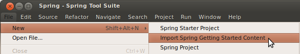
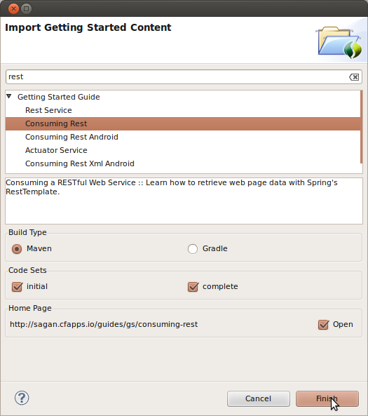
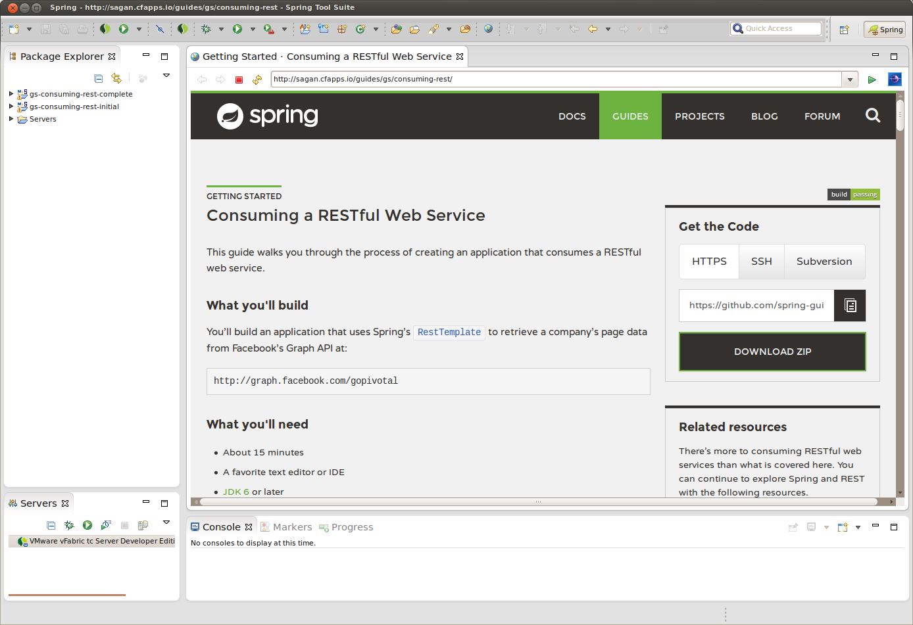

:spring_boot_version: 1.5.6.RELEASE
:jdk: http://www.oracle.com/technetwork/java/javase/downloads/index.html
:gs-maven: link:/guides/gs/maven
:gs-gradle: link:/guides/gs/gradle
:gs-consuming-rest: link:/guides/gs/consuming-rest
:toc:
:icons: font
:source-highlighter: prettify
:project_id: gs-sts

本指南通过使用Spring工具套件（STS）来构建一个入门指南。

== 你将构建什么

您将选择一个Spring指南并将其导入Spring工具套件中。然后您可以阅读指南，编写代码，并运行该项目。

== 你需要什么

 - 大概15分钟
 - http://spring.io/tools/sts/all[Spring工具套件 (STS)]
 - {jdk}[JDK 8] 或更新的版本

== 安装 STS
如果您还没有安装STS，请访问上面的链接。从那里，您可以为您的平台下载一个副本。要安装它只需解压缩下载的档案。

当你完成后，继续启动STS。

== 导入入门指南

随着STS的启动和运行，从打开 **File** 菜单打开 **Import Spring Getting Started Content** 向导。

弹出式向导将为您提供从Spring网站搜索和选择任何已发布指南的机会。您可以浏览列表，也可以输入搜索词来过滤选项。

NOTE: 当提供即时搜索结果时是支持通配符，该标准适用于标题和描述。

你可以选择 {gs-maven}[Maven] 或 {gs-gradle}[Gradle] 作为构建系统使用。

您还可以决定是否使用 **initial** 代码集、 **complete** 代码集，或者两者都使用。对于大多数项目， **initial** 代码集是一个空项目，可以让你用来根据指南复制和粘贴。 **complete** 的代码集是指南中已经输入的所有代码。如果你使用两者，你可以比较你的工作与指南的差异。

最后，您可以在STS上打开一个浏览器选项卡访问在网站上的指南。这可以让你完成指南而不必离开STS。

为完成本指南的目的，在即时搜索框中输入 **rest** 。然后选择 {gs-consuming-rest}[Consuming Rest] 。选择 **Maven** 作为构建系统、 **initial** 和 **complete** 代码集。也可以选择打开网页，如下所示：

STS将在您的工作区中创建两个新项目，导入 {gs-consuming-rest}[Consuming Rest] 代码（initial和complete），并在STS内打开一个浏览器选项卡，如下所示：

从这里，您可以浏览指南并导航到代码文件。

== 总结

祝贺你!您已经安装了Spring工具套件，导入了消费REST入门指南，并打开了一个浏览器选项卡来浏览它。

== 参考

下面的指南可能也有帮助：

* http://knos.top/guides/gs/intellij-idea/[使用 IntelliJ IDEA运行入门指南]

include::https://raw.githubusercontent.com/webGoBetter/getting-started-macros/master/footer.adoc[]
